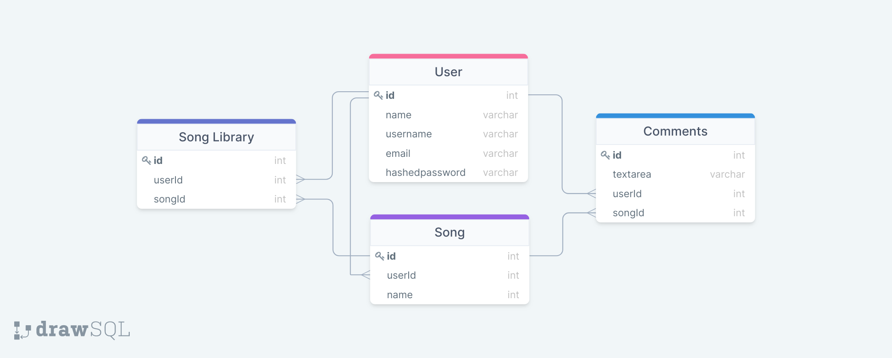

# Radiant Music App

## About

Radiant is a music app built using React, Redux for the frontend and Express, PostgreSQL + Sequelize for the backend

## Checkout the live App @ [Radiant Music App](https://radiant-music.herokuapp.com/)

## Features

1. User authentication:

    - Sign-in and Sign-up
    - Sign-in as a Demo User

2. Song Library

    - List of all the songs
    - Play/Choose the song from the library
    - Highlight the currenty playing song in the library

3. Songs Controls

    - Play the song
    - Pause the song
    - Go to the next song
    - Go to the last song
    - Rewind the song
    - Fast forward the song
    - Show song playtime and total length
    - Progress of the current song on the progress bar

4. Control Song Volume

    - Increase/Decrease the volume
    - Mute/Unmute

_Extras_

1. User Profile with song library
2. Comment on Songs
3. Add and delete songs
4. Login using Google Oauth

## Database Schema

